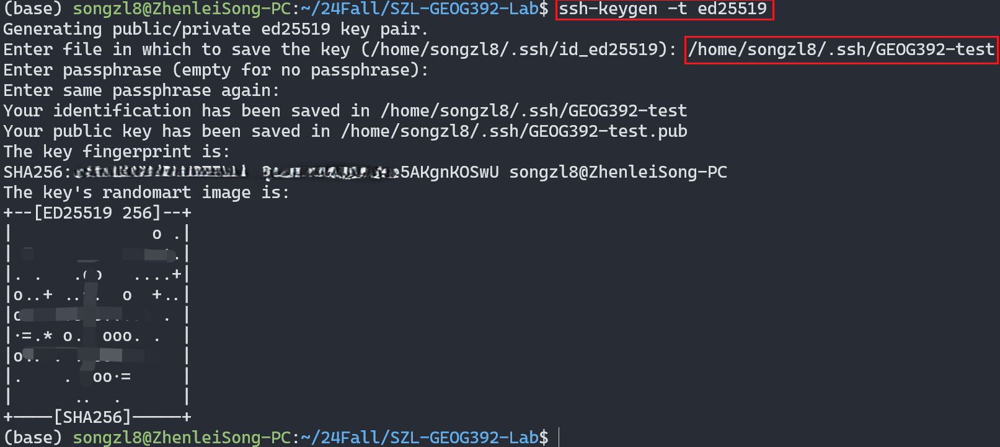

# GEOG-392/676 GIS Programming: Lab 01

>**Topic:** GitHub Setup
>
>**100 pt**
>

## Due Dates and Submission Instructions

> **where**: canvas link
> 
> **when**: before next lab
>
> **what**: screenshot of your VSCode `README.md`

## **Outcomes:**

1. Learn what is Github and how to use it to share your work with others.
2. Learn how to create a new repo.
3. Learn how to upload files to your Github repo using Git Extension/Command Line.

## **Task:**

1. Create a Github account
2. Create a **private** repo for this class named by `<your-initials>-GEOG392-Lab`
3. Download and install Git, VSCode, Python
4. Get your development environment setup and **WORKING**
5. Clone your repo for this course on your local environment
6. Create the structure of folders for labs, homeworks, and projects with readme.md's inside of your repo for this class

### **Create Github Account**


### **Create a `Private Repo` for this course**


### **Tools Download & Install**

#### Git

[Git Download](https://git-scm.com/downloads)


#### VSCode

[VSCode Download](https://code.visualstudio.com/download)


#### Python

[Python Download](https://www.python.org/downloads/release/python-31011/). In the labs of this course, we recommend Python version 3.10.11 as major version, because its support for most packages' new features with stable maintainance at the same time.


## **Repo Setup**

### SSH Keygen



Locate your `public key` file and copy everything.
Paste it in the Github Setting. So that ssh clone can be used.


### Git clone commands


> git clone `<your-repo-url>`


### Add folders

create `labs` `projects` `homeworks` folders.
Edit the file to be your "homepage" by putting:

> Your name
>
> A table with links to your labs and homework

You can use this link to help you write better looking Markdown files. Now that you have all that you can commit your changes and push them to your repository. Make sure your terminal / command prompt is currently in your repository directory and use this command to stage and commit your changes:

## Results


## Optional

1. Add me (Zhenlei Song, songzl@tamu.edu) as a collaborator.
2. push local changes to remote repo.

    ```shell
    git add *
    git commit -m "Edited the main README.md"
    git push origin main
    ```

## Useful Links

[MIT Missing Semester for CS students](https://missing.csail.mit.edu/)

[Git/Github hands on demo](https://docs.google.com/presentation/d/1_iuZPqEGW1sJgOoJnj5CYeFAvgiRIKOIE1FzqvZ7t7Q/edit?usp=sharing)

[ssh keygen by Microsoft](https://learn.microsoft.com/en-us/windows-server/administration/openssh/openssh_keymanagement)

[add ssh key to Github](https://docs.github.com/en/authentication/connecting-to-github-with-ssh/generating-a-new-ssh-key-and-adding-it-to-the-ssh-agent)

[Github Student Developer Pack](https://education.github.com/pack)

VS Code Plugins Recommendation

- [Python](https://marketplace.visualstudio.com/items?itemName=ms-python.python)
- [Pylance](https://marketplace.visualstudio.com/items?itemName=ms-python.vscode-pylance)
- [Python Debugger](https://marketplace.visualstudio.com/items?itemName=ms-python.debugpy)
- [GitLens](https://marketplace.visualstudio.com/items?itemName=eamodio.gitlens)
