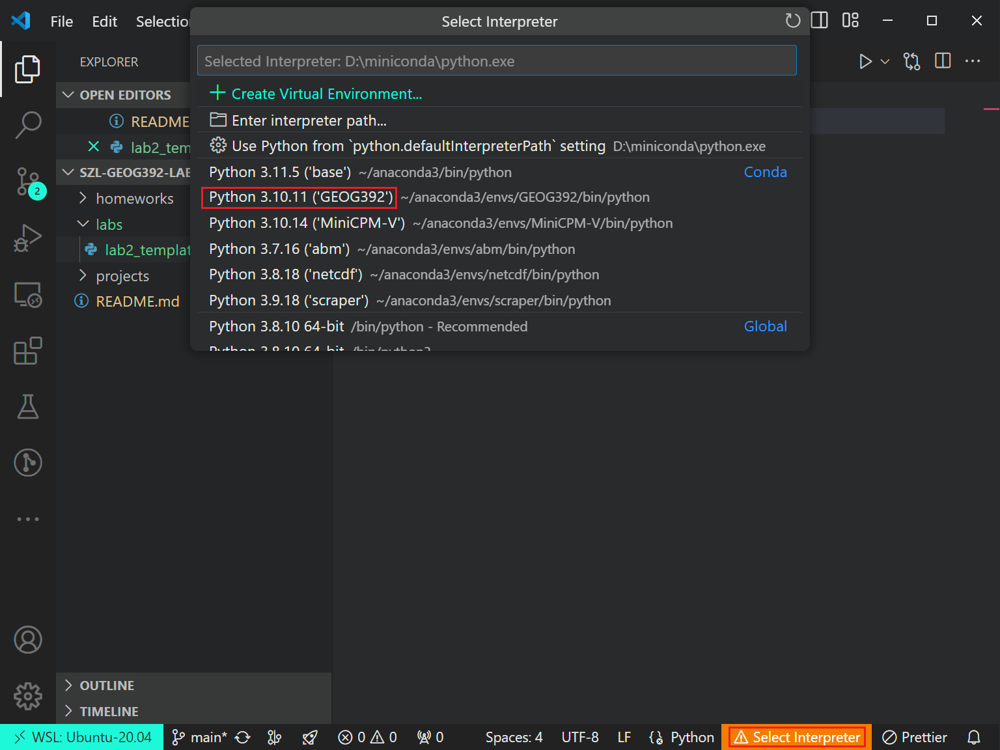
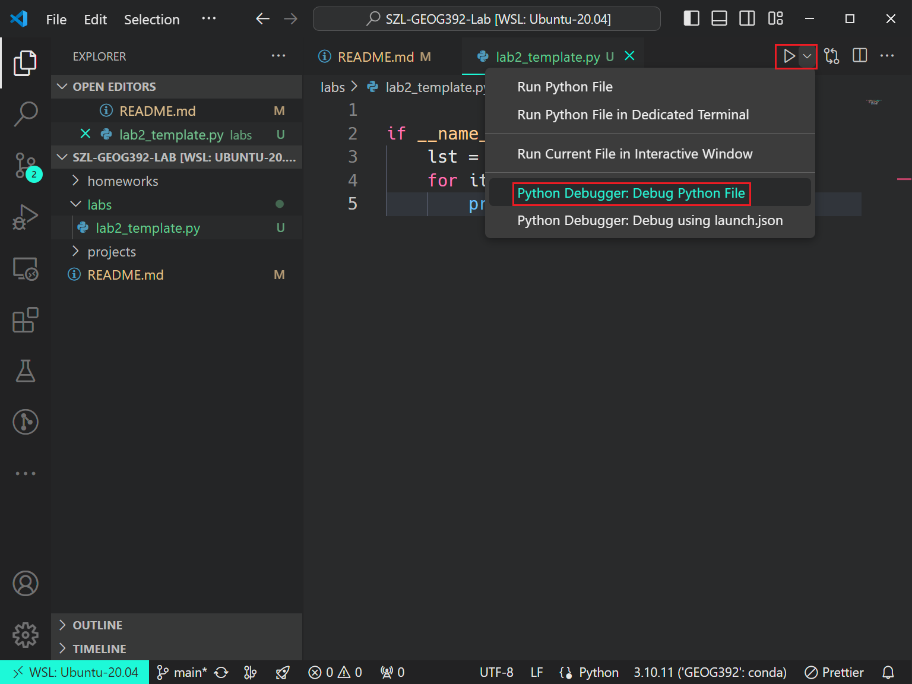
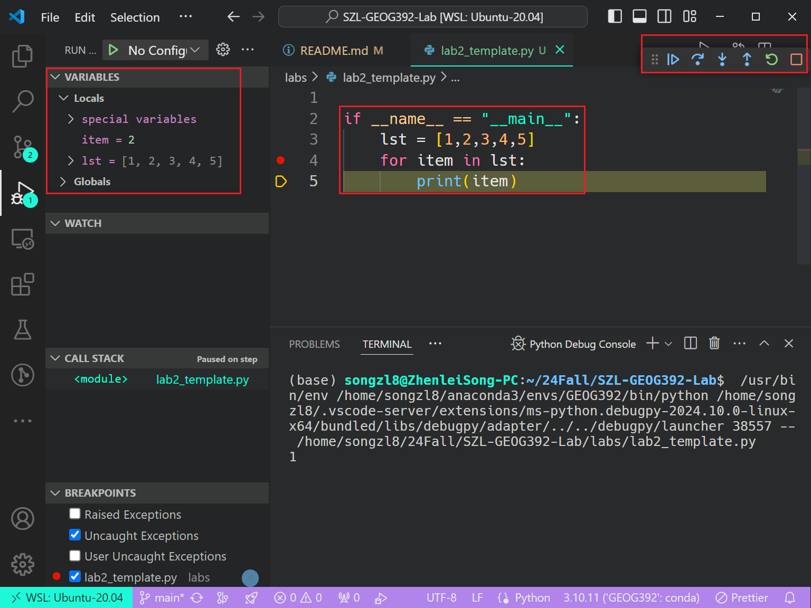

# GEOG-392/676 GIS Programming: Lab 02

>**Topic:** Python Loops & Conditionals
>
>**100 pt**
>

## Due Dates and Submission Instructions

> **where**: canvas link
>
> **when**: before next lab
>
> **what**: a PDF including all your code and results

## **Task:**

1. Learn how to use Python loops to automate tasks.
2. Learn how to use Python conditionals to control the flow of your program.
3. Debug Using VSCode.

### **Loops**

#### **For Loop**

```python
for i in range(5):
    print(i)
```

#### **While Loop**

```python
i = 0
while i < 5:
    print(i)
    i += 1
```

#### **Nested Loop**

```python
for i in range(3):
    for j in range(3):
        print(i, j)
```

#### **Loop Control Statements**

```python
for i in range(5):
    if i == 3:
        break
    print(i)
```

### **Conditionals**

```python
x = 10
if x > 5:
    print("x is greater than 5")
elif x == 5:
    print("x is 5")
else:
    print("x is less than 5")
```

### **Debugging Using VSCode**

#### **Select Python Interpreter**



#### **Init Python Debugger**



#### **Debugging Interface**



## **Assignment Questions:**

1. Take the following list and multiply all list items together. (30pts)

    ```python
    lst1 = [1,2,4,8,16,32,64,128,256,512,1024]
    ```

2. Take the following list and add all list items together. (30pts)

    ```python
    lst2 = [-1, 23, 483, 8573, -1384, -381569, 1652337, 718522177]
    ```

3. Take the following list and only add the items are even. **Hint: Use the [modulo](https://en.wikipedia.org/wiki/Modulo_operation) operator** (40pts)

    ```python
    lst3 = [146, 875, 911, 83, 81, 439, 44, 5, 46, 76, 61, 68, 1, 14, 38, 26, 21]
    ```

## **Useful Links:**

- [Modulo operation in Python](https://www.w3schools.com/python/python_operators.asp)
- [Python Operators](https://docs.python.org/3/reference/expressions.html#operator-precedence)
- [Python Debugging](https://realpython.com/python-debugging-with-pdb/)
- [VSCode Debugging](https://code.visualstudio.com/docs/python/debugging)
- [Python Playground](https://www.online-python.com/)
