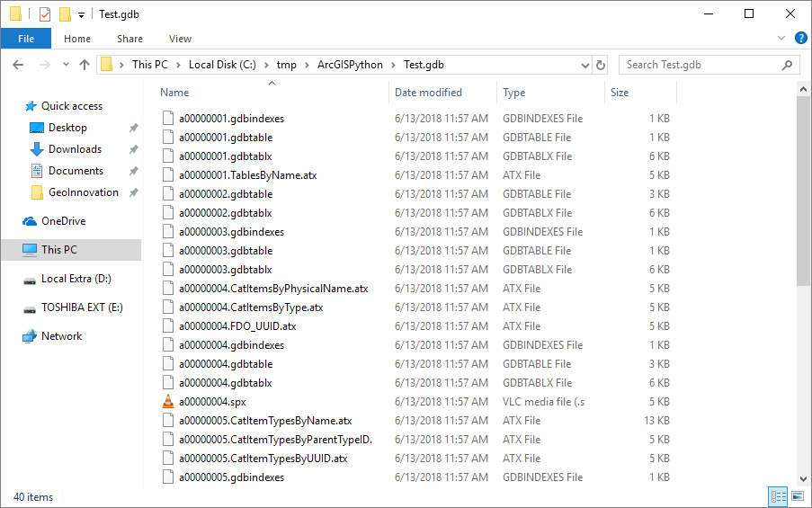

# GEOG-392/676 GIS Programming

## Learning Objectives

- Use arcpy to set a workspace
- Use arcpy to create a geodatabase
- Learn how to find example arcpy code (from esr help pages - at the bottom of each tool)

## Setup arcpy

Hopefully you already have your arcpy setup, if not please refer back to this [lecture](https://github.tamu.edu/TAMU-GEOG-676-GIS-Programming/Content/blob/master/modules/03.md) for directions.

## Using arcpy

In order to use ESRI's sweet array of GIS tools and operations within Python, all we have to do is import the functionality from the **arcpy** module. To do this we use a simple import statement like what is shown below. 
>
```python
import arcpy
```
>
Once we have **arcpy** *imported* into our project, we are free to use a vast array of new functions that come from the **arcpy** module. Below, we'll be putting this module to setup a very basic work environment with Python.
>
### Our environment

Our environment is kind of the overall *settings* of our script; inside is a large amount of default values that our script can use such as a default XYResolution or the extent of our data. We can see what all our environment entails by printing out the result of **ListEnvironments()**. The python/help for this Esri environment settings is [Environment](https://pro.arcgis.com/en/pro-app/arcpy/geoprocessing_and_python/using-environment-settings.htm)

```python
print(arcpy.ListEnvironments())
# Prints...
['autoCommit', 'XYResolution', 'processingServerUser', 'XYDomain', 'processingServerPassword', 'scratchWorkspace', 'cartographicPartitions', 'terrainMemoryUsage', 'MTolerance', 'compression', 'coincidentPoints', 'randomGenerator', 'outputCoordinateSystem', 'rasterStatistics', 'ZDomain', 'transferDomains', 'S100FeatureCatalogueFile', 'maintainAttachments', 'resamplingMethod', 'snapRaster', 'cartographicCoordinateSystem', 'configKeyword',
'outputZFlag', 'qualifiedFieldNames', 'tileSize', 'parallelProcessingFactor', 'pyramid', 'referenceScale', 'processingServer', 'extent', 'XYTolerance', 'tinSaveVersion', 'nodata', 'MDomain', 'cellSize', 'outputZValue', 'outputMFlag', 'geographicTransformations', 'ZResolution', 'mask', 'maintainSpatialIndex', 'preserveGlobalIds', 'workspace', 'MResolution', 'baDataSource', 'ZTolerance', 'scratchGDB', 'scratchFolder', 'packageWorkspace', 'scriptWorkspace', 'addOutputsToMap']
```
>
The values here can be changed in a few ways such as if the script was run from within ArcGIS Pro or from a standalone Python terminal. If run a script from ArcGIS Pro, the environment from ArcGIS is passed into the script and overrides our environment.

### Setting our workspace

ESRI defines our script's workspace as the location from which inputs are taken and outputs are placed when running tools. In ArcGIS Pro, if you do not set the workspace, it will default to the file geodatabase that is the default one for the map you are currently working on. You may or may not want this, luckily we can set this. We can set our workspace directory by editing our environment in the following way:
>
```python
arcpy.env.workspace = "C:/tmp/ArcGISPython"
```
>
We simply use the arcpy module and reference the environment variable's **workspace** attribute. This attribute is mutable, meaning we can change its value. We then set where we want our workspace directory to be. It's that simple!

### Setting scratch workspace

ESRI defines our script's scratch workspace as the location tool outputs are placed if the default output name is used. The scratch workspace is intended for output data you do not wish to maintain. In ArcGIS Pro, if you do not set the scratch workspace, it will default to the file geodatabase that is the default one for the map you are currently working on. You may or may not want this, luckily we can set this.  We can easily change our scratch workspace as it too is just a mutable attribute of our **env** object inside of **arcpy**. 
>
```python
arcpy.env.scratchWorkspace = "C:/tmp/ArcGISPython/scratch"
```
>
### Creating a geodatabase

We can also create our very own geodatabase using a simple arcpy function called **CreateFileGDB_management()**. Once again thanks to Python's high level of readability, it is quite easy to figure out what this function does: it creates a file geodatabase. This function takes in two parameters: the path we want to create our .gdb and the name of our geodatabase. When we run the code below we end up with a blank geodatabase at the path specified. The python/help for this Esri tool is [Create File Geodatabase](http://pro.arcgis.com/en/pro-app/tool-reference/data-management/create-file-gdb.htm)
>
```python
folder_path = "C:/tmp/ArcGISPython"
arcpy.CreateFileGDB_management(folder_path, "Test.gdb")
```
>
>

>


## Additional resources

- [Current Workspace](http://pro.arcgis.com/en/pro-app/tool-reference/environment-settings/current-workspace.htm)
- [Scratch Workspace](http://pro.arcgis.com/en/pro-app/tool-reference/environment-settings/scratch-workspace.htm)
- [Create File Geodatabase](http://pro.arcgis.com/en/pro-app/tool-reference/data-management/create-file-gdb.htm)

### Videos

[Module4-Topic4](https://youtu.be/OL0Bj7uw_8w)