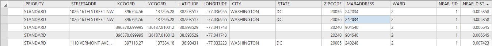
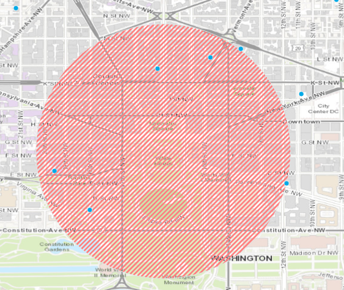
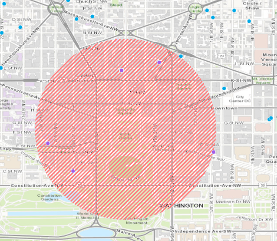
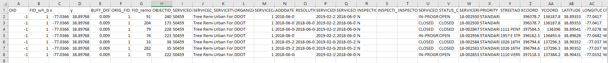

# GEOG-392/676 GIS Programming

## Learning Objectives

- Learn how to add layers existing layers to Geodatabase
- Explore how to create and calculate a new field for a layer
- Detail how to buffer points in a layer
- Learn how to intersect layers
- Output a table

## Basic operations

In this lecture, we are going to explore how one would do some basic operations for ArcGIS Pro while using Python. We'll start with two layers: a layer showing the point data of recently removed trees in the DC area and a layer with a single point on the White House. From there, we will be calculating the distance from each tree to the White House and adding the distance to each tree as a new field in their attribute table. Once we have our distance field, we will be performing a basic buffer just because we can and it's crazy simple. The last two operations we'll perform are an intersect and a table output.

## Managing the Geodatabase

To start, we'll be creating a brand new Geodatabase. We start by importing the **arcpy** module and then setting our environment workspace. After that we simply call the arcpy function **CreateFileGDB_management()** and provide the name of our GDB and the path it will reside. The python/help for this Esri tool is [Create File Geodatabase](http://pro.arcgis.com/en/pro-app/tool-reference/data-management/create-file-gdb.htm)
>
```python
import arcpy
arcpy.env.workspace = "C:/tmp/ArcGISPython"
arcpy.CreateFileGDB_management(arcpy.env.workspace, "DC.gdb")
```
>
Now that we have our **DC.gdb** geodatabase, we need to add in our data layers. The first layer that contains the recently removed trees can be found [here](http://hub.arcgis.com/datasets/53b4afcee29a470e858d0c60bd70b35b_28). Make sure you download it as a shapefile. Make sure to save this shapefile to a location you know, such as your environment workspace directory. With that downloading, go ahead and open up Notepad or some other text editor and create a new comma-separated file called **wh.csv**. This simple .csv contains the latitude and longitude of the White House in Web Mercator. Paste in the following and save the file.
>
```python
x,y
-77.036550,38.897680
```
>
With our two layers inside our workspace, we now need to add our data into the geodatabase. To do this, we must use two functions: one to turn our .csv into a feature class, then one to take both inputs and put them in the geodatabase.
>
```python
whitehouse = arcpy.management.MakeXYEventLayer("wh.csv", "x", "y", "wh")
```
>
The snippet above takes in the csv and turns it into a shapefile which we keep a reference to using our **whitehouse** variable. We then pass that reference into a function to insert **whitehouse** along with our tree layer into our newly created geodatabase. We create a new list variable called **input_layers** where we give it the name of the tree layer and the reference to our newly created **whitehouse** layer. Then we use the **FeatureClassToGeodatabase_conversion()** method to copy our layers into our geodatabase.
>
```python
input_layers = ["removed_trees.shp", whitehouse]
arcpy.FeatureClassToGeodatabase_conversion(input_layers, r"C:/tmp/ArcGISPython/DC.gdb")
```
>

## Calculating the distance with Near tool

Now that we have our geodatabase with our data, we can now calculate the distance from each removed tree to the White House. We first create a new variable that references the path to our geodatabase called **dcGdb**. Once we have that variable, we can use the **analysis.Near()** method to calculate the distances. The python/help for this Esri tool is [Near](http://pro.arcgis.com/en/pro-app/tool-reference/analysis/near.htm)
>
Since we're using the feature classes inside our geodatabase and not a plain shapefile, we just need to reference the feature's name using the path to the geodatabase and a forward slash. So instead of having something like "removed_trees.shp", we have something like "/removed_trees".
>
```python
dcGdb = r"C:/tmp/ArcGISPython/DC.gdb"
arcpy.analysis.Near(dcGdb + "/removed_trees", dcGdb + "/wh", None, "NO_LOCATION", "NO_ANGLE", "PLANAR")
```
>
This method calculates the distance between each tree in the "removed_trees" feature class and adds that distance as a new field to each tree.
>

>

## Buffer

The next basic operation we'll perform is a simple buffer around the White House. Not a terribly useful operation with the data we have, but it's something! To add a buffer layer to our geodatabase, we reference the input feature class **wh**, specify the new layer's name, and the size of the buffer. The python/help for this Esri tool is [Buffer](http://pro.arcgis.com/en/pro-app/tool-reference/analysis/buffer.htm)
>
```python
arcpy.Buffer_analysis(dcGdb + "/wh", dcGdb + "/wh_buffered", .009)
```
>
>

>

## Intersection

ESRI's documentation for Intersect can be found [here](http://pro.arcgis.com/en/pro-app/tool-reference/analysis/intersect.htm)
>
The next basic operation we'll perform is a simple intersection between two layers. An intersection will compute a new layer from the the geometric intersection between the input layers. We'll use this tool to get those removed trees that intersect with our White House buffer layer. To use the tool, we provide three parameters: a list defining our input layers, a string defining the name of the output layer with the geometry intersection, and a list containing which attributes we want to keep in the resulting layer.
>
```python
arcpy.Intersect_analysis([dcGdb + "/wh_buffered", dcGdb + "/removed_trees"], dcGdb + "/intersection", "ALL")
```
>
When we run this line, we end up with a new layer that contains all the removed trees that intersect our buffer.
>

>

## Output to Table

ESRI's documentation for Table to Table can be found [here](http://pro.arcgis.com/en/pro-app/tool-reference/conversion/table-to-table.htm)
>
The next basic operation we'll perform is to output a layer to a table. We'll be outputting our calculated intersection layer as a standard .csv. The first parameter of this tool is the **.dbf** of our layer in question. The second parameter is the path where we want to save the .csv. The last parameter is the name and file extension of the resulting file.
>
```python
arcpy.TableToTable_conversion(dcGdb + "/intersection.dbf", "C:/tmp/ArcGISPython", "intersection.csv")
```
>
>

>

## Common errors
>
Error message | Solution
--- | ---
`RuntimeError: ERROR 999999: Error executing function.` | Your field name may not be correct; try double checking your spelling.
`arcgisscripting.ExecuteError: ERROR 000258: Output C:\tmp\ArcGISPython\DC.gdb already exists` | Your Geodatabase named **DC.gdb** already exists.
`arcgisscripting.ExecuteError: ERROR 000464: Cannot get exclusive schema lock.  Either being edited or in use by another application.` | You probably have that layer open in ArcGIS, either remove that layer or close ArcGIS.
`ERROR 000354: The name contains invalid characters` | When setting the parameters for the intersect tool, make sure the first one is your input, the second is just the path to where you want the output to be, and the third parameter is the name of the output table.

## Additional resources

- [Using Tools in Python](http://pro.arcgis.com/en/pro-app/arcpy/geoprocessing_and_python/using-tools-in-python.htm)

### Videos

- [Module4-Topic5a](https://youtu.be/DSMeKs4pEA4)
- [Module4-Topic5b](https://youtu.be/MyBsC6omxL4)
