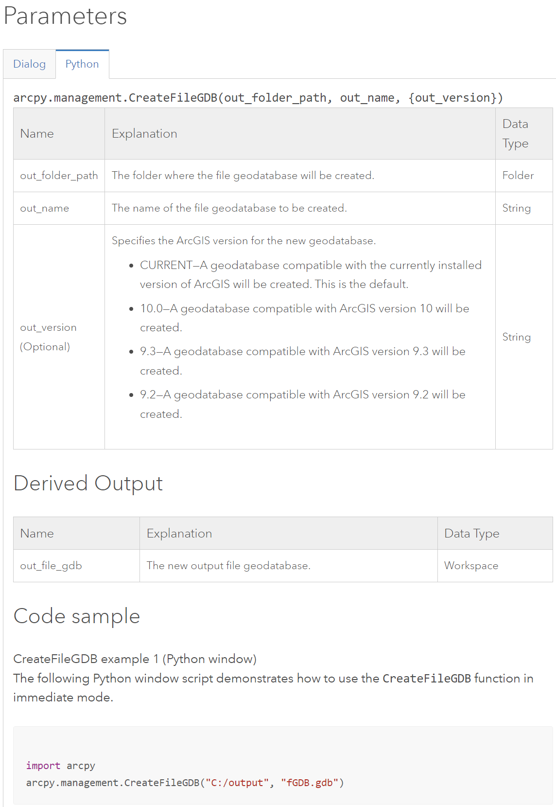

# GEOG-392/676 GIS Programming: Lab 04

>**Topic:** ArcPy GDB Basics
>
> **100 pt**
>

## **Due Dates and Submission Instructions**

> **where**: canvas link
>
> **when**: before next lab
>
> **what**: a PDF including all your code and results

## **Task:**

> **Goal: Find out which buildings are within the range of 150 meters to garages in TAMU main campus**.

1. Setup workspace with the input `GeoDatabase` (Campus.gdb)
2. Create a blank `GDB` as output
3. Load the .csv file (`garages.csv`) to a Point Feature Layer in the input `GDB`
4. Re-project feature classes
5. Buffer analysis on the `garages` layer
6. Intersect analysis on the bufferred layer and the `Structure` feature layer
7. Output **4 layers** to the output GDB, inlcuding:
   1. garage layer
   2. Structure layer
   3. buffered layer
   4. intersected layer

## **Reading Resources Before Lab:**

- [Basic ArcPy](./Lab04-pre01.md)
- [ArcPy Operations](./Lab04-pre02.md)

## **Preparations**

From this lab, we need to use the pre-installed `python` env from `ArcGIS Pro`. You can locate it by the steps below:

1. Open ArcGIS Pro and stay in the landing page. Then go to settings.
   
2. Go to `Package Manager` -> you should see the `arcgispro-py3` env on the right side. Click on the wheel icon.
   
3. You can find the path to this default `python` env by ArcGIS pro with `arcpy` package preinstalled. Copy the path!
   
4. Go to `VS Code` and activate this path as current `python` interpreter.
   
5. Find the `arcgispro-py3` path and select the `python.exe` under this path.
   

**Then you should be able to use `arcpy` within this env.**

## **Lab Steps**

### **1. Data Sources**

Download the [Lab4_Data.zip](./data/Lab4_Data.zip) and unzip it to your working directory.


Here is a brief view of the "Campus.gdb" and "garages.csv"


### **2. Setup workspace**

```python
import arcpy
import os

BASE_DIR = os.path.dirname(os.path.abspath(__file__))
INPUT_DB_PATH = ***
CSV_PATH = ***
OUTPUT_DB_PATH = ***

# make input GDB path as the base working path 
arcpy.env.workspace = INPUT_DB_PATH
```

Useful Tutorials:

- [Python os tutorial](https://docs.python.org/3/library/os.path.html)
- [ArcPy Docs](https://pro.arcgis.com/en/pro-app/latest/arcpy/main/arcgis-pro-arcpy-reference.htm)

### **3. Create GDB Management**

Create a blank GDB management using

```python
arcpy.management.CreateFileGDB()
# OR in old version
arcpy.CreateFileGDB_management()
```

`arcpy.CreateFileGDB_management` documentation: [link](https://pro.arcgis.com/en/pro-app/latest/tool-reference/data-management/create-file-gdb.htm)


### **4. Load .csv table file**

Load the `.csv` file as a Point Feature Layer.

**Note:** Don't load `.csv` file as a bare table, because we need to apply spatial analysis operations on it.

```python
arcpy.management.XYTableToPoint()
# OR
arcpy.management.MakeXYEventLayer()
```

`arcpy.management.XYTableToPoint` documentation: [link](https://pro.arcgis.com/en/pro-app/latest/tool-reference/data-management/xy-table-to-point.htm)
`arcpy.management.MakeXYEventLayer` documentation: [link](https://pro.arcgis.com/en/pro-app/latest/tool-reference/data-management/make-xy-event-layer.htm)


### **5. Re-Projection**

The `projection systems (spatial references)` might be different in 2 data sources. Use the following methods to show and change the `spatial references` of all data sources.

`arcpy.Describe()`: [Link](https://pro.arcgis.com/en/pro-app/latest/arcpy/functions/describe.htm)

`Spatial Reference`: [Link](https://pro.arcgis.com/en/pro-app/latest/arcpy/classes/spatialreference.htm)

Reproject a feature class to another projection system using `arcpy.management.Project()` or `arcpy.Project_management()` in older versions.

`arcpy.management.Project()`: [Link](https://pro.arcgis.com/en/pro-app/latest/tool-reference/data-management/project.htm)

Code Sample:

```python
# Print spatial references before re-projection
print(arcpy.Describe("garages").spatialReference.name)
print(arcpy.Describe("Structures").spatialReference.name)

# re-project
target_ref = arcpy.SpatialReference("***")
arcpy.management.Project(
   "******",
   "******",
   target_ref
)

# print spatial references after re-projection
print(arcpy.Describe("******").spatialReference.name)
print(arcpy.Describe("******").spatialReference.name)
```


### **6. Buffer Analysis**

Apply `buffer analysis` on the `garages` point feature layer we just loaded with `arcpy.Buffer_analysis()` or `arcpy.analysis.Buffer()` **Note:** the buffer distance is `150 meters`. Here is the `arcpy.analysis.Buffer()` method documentation: [link](https://pro.arcgis.com/en/pro-app/latest/tool-reference/analysis/buffer.htm)

**Note:** Name the buffering output layer as `garages_buffered`.


### **7. Intersect**

Apply `intersect analysis` on the `garages_buffered` layer and the `Structures` layer. To get **buildings which are located in the distance range** of 150 meters to garages. Use `arcpy.Intersect_analysis()` or `arcpy.analysis.Intersect()`. Here is the `arcpy.analysis.Intersect()` method documentation: [link](https://pro.arcgis.com/en/pro-app/latest/tool-reference/analysis/intersect.htm)

**Note:** Name the intersection output feature layer as `intersection`.


### **8. Export**

Export 4 feature layers to the output `GDB`, including:

- `garages`
- `Structure`
- `garages_buffered`
- `intersection`

You might need to use `arcpy.CopyFeatures_management()` or `arcpy.management.CopyFeatures()` method, documentation is [here](https://pro.arcgis.com/en/pro-app/latest/tool-reference/data-management/copy-features.htm)


## **Results**

If you process is correct, you can try to view your output GDB in ArcGIS pro and examine it yourself. It should look like this:


## **Submission**

To get full points, your submission should be a single PDF file including the following:

- A screenshot of all your codes.
- A screenshot of terminal shell that shows your codes run successfully (No errors).
- A screenshot of the ArcGIS pro page shows how does your output GDB look like. (like in the `Results` section).
- A link to your Github repo.

About the screenshot of terminal, refer to the steps below.

1. Click on the triangle button in `VS Code` to run your codes.
   

2. Take a screenshot of the terminal window to show your codes can run without error.
   

## Useful Links

- [ArcPy Documentation](https://pro.arcgis.com/en/pro-app/latest/arcpy/main/arcgis-pro-arcpy-reference.htm)
- [Python in ArcGIS Pro](https://pro.arcgis.com/en/pro-app/latest/arcpy/get-started/installing-python-for-arcgis-pro.htm)
- [Available Python Libs in ArcGIS Pro](https://pro.arcgis.com/en/pro-app/latest/arcpy/get-started/available-python-libraries.htm)
- [Debugging in VS Code](https://code.visualstudio.com/docs/editor/debugging)
