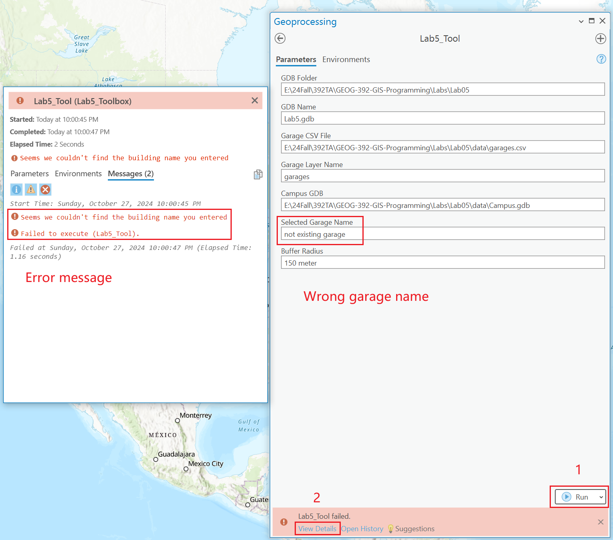

# GEOG-392/676 GIS Programming: Lab 05

>**Topic:** ArcPy Tool & Toolbox
>
> **100 pt**
>

## **Due Dates and Submission Instructions**

> **where**: canvas link
>
> **when**: before next lab
>
> **what**: a PDF including all your code and results

## **Task:**

> **Goal**:
>
> 1. Turn the python script from Lab4 into a Tool.
> 2. Turn such tool into a toolbox.
>

## **Reading Resources Before Lab:**

- [Arcpy Tool](./Lab05-pre01.md)
- [ArcPy ToolBox](./Lab05-pre02.md)

## **Important Notes:**

- DON'T just copy the pieves from the sample script and move on. Try to adapt your codes to the template to make a `python console tool` and a `arcpy toolbox`. You **WILL NOT** use all your Lab4 script, but critical parts (last two `analysis` funcs will fit in).
- The concept `arcpy tool` is not accurate. It's actually a `terminal/console tool`, which accepts user's input from terminal and these input will serve as parameters of functions calling in `arcpy`.
- **DONT'T** lean on the pre-reading materials a lot. They just gave instructions about how to create `tool` and `toolbox`, expecially the `toolbox` instruction.
- You will need to rename the `Tool` class into something reflects your purpose. Make sure the reference in the `__init__` func is correct.
- For the `toolbox` part, add `success` and `error` message properly. For success message: use `arcpy.AddMessage("Success")`; for error message **DON'T** just use `print()`. Use `arcpy.AddError()` instead.

## **Create a Tool**

### **Step 1. Accept parameters from user input.**

Use [`input`](https://cs.stanford.edu/people/nick/py/python-input.html) method to accept user input from terminal. Only 2 items are required:

```python
# which garage needs to be buffered.
Selected_Garage_Name = ***

# Buffer distance.
Buffer_Radius = ***
```

The rest items are optional. That means you can fix the rest varibles as fixed like you did in Lab4 or like the paths above.

```python
### >>>>>> Add your code here
"""
Here are some hints of what values the following variables should accept.
When running, the following code section will accept user input from terminal
Use `input()` method.

GDB_Folder = "***/Labs/Lab5"
GDB_Name = "Lab5.gdb"
Garage_CSV_File = "***/Labs/Lab5/garages.csv"
Garage_Layer_Name = "garages"
Campus_GDB = "***/Labs/Lab5/Campus.gdb"
Selected_Garage_Name = "Northside Parking Garage"
Buffer_Radius = "150 meter"
"""
### >>>>>> Add your code here
print("Please input the following parameters:\n")
GDB_Folder = 
GDB_Name = 
Garage_CSV_File = 
Garage_Layer_Name = 
Campus_GDB = 
Selected_Garage_Name = 
Buffer_Radius = 
### <<<<<< End of your code here
```

### **Step 2. Determine whether the selected building.**

You need to add codes to determine if the selected building exists.

- Use a search cursor ([`arcpy.da.SearchCursor`](https://pro.arcgis.com/en/pro-app/latest/arcpy/data-access/searchcursor-class.htm))
- Use a loop to match `rows` in a cursor.
- Within each loop, determine if the seartch cursor found the value the user entered. If so, proceed. If not, then exit with error message.

```python
"""
Create a searchCursor.
Select the garage with `where` or `SQL` clause using `arcpy.analysis.Select` method.
Apply `Buffer` and `Clip` analysis on the selected feature.
Use `arcpy.analysis.Buffer()` and `arcpy.analysis.Clip()`.
"""
### >>>>>> Add your code here
#search surcor
structures = Campus_GDB + "/Structures"
where_clause = "BldgName = '%s'" % Selected_Garage_Name
cursor = arcpy.da.SearchCursor(***)

shouldProceed = False

for row in cursor:
    if row.getValue("BldgName") == Selected_Garage_Name:
        shouldProceed = True

if shouldProceed == True:
    ###
    # Next Step
    # insert this section in the next step
    ###
    ###
    print("success")
else:
    ***
    print("error")
### <<<<<< End of your code here
```

### **Step 3. Buffer & Clip**

When the cursor find the garage name, select the `garage_feature` and then buffer on this sub-feature. Then clip the `structures` on the selected garage buffer.

APIs:

- [`arcpy.analysis.Select`](https://pro.arcgis.com/en/pro-app/latest/tool-reference/analysis/select.htm)
- [`arcpy.analysis.Buffer`](https://pro.arcgis.com/en/pro-app/latest/tool-reference/analysis/buffer.htm)
- [`arcpy.analysis.Clip`](https://pro.arcgis.com/en/pro-app/latest/tool-reference/analysis/clip.htm)

```python
if shouldProceed:
    #select garage as feature layer
    selected_garage_layer_name = GDB_Full_Path+"/garage_selected"

    #use where clause or SQL clause in `arcpy.analysis.Select`
    garage_feature = arcpy.analysis.Select(***)

    # Buffer the selected building
    garage_buff_name = "/building_buffed"
    arcpy.analysis.Buffer(***)

    #clip
    arcpy.analysis.Clip(***)

    print("success")
else:
    print("error")
```

When you run the code, it should look like this:


## **Create a ArcGIS Pro Toolbox**

### Option 1. Create a new toolbox


### Option 2. Add a toolbox from a `***.pyt` file


The `***.pyt` template includes 2 classes.

- Toolbox class
- Tool class(rename as `Lab5Tool` for example)

```python
# -*- coding: utf-8 -*-

import arcpy
import os

class Toolbox(object):
    def __init__(self):
        """Define the toolbox (the name of the toolbox is the name of the
        .pyt file)."""
        self.label = "Lab5_Toolbox"
        self.alias = "Lab5_Toolbox"

        # List of tool classes associated with this toolbox
        self.tools = [Lab5_Tool]


class Lab5_Tool(object):
    def __init__(self):
        """Define the tool (tool name is the name of the class)."""
        self.label = "Lab5_Tool"
        self.description = ""
        self.canRunInBackground = False

    def getParameterInfo(self):
        ...
    ...
```

In the `Tool` class, 3 functions are required:

- `__init__()`
- `getParameterInfo()`
- `excute()`

Read [create a toolbox](./Lab05-pre02.md) for details.

`getParameterInfo()` implementation: use `arcpy.Parameter()` refer to [arcgis parameter doc](https://pro.arcgis.com/en/pro-app/arcpy/geoprocessing_and_python/defining-parameter-data-types-in-a-python-toolbox.htm). ***This doc is very very very important.***

Here is an example of `getParameter()` in `Tool` class:

```python
def getParameterInfo(self):
    """Define parameter definitions"""
    param_GDB_folder = arcpy.Parameter(
        displayName="GDB Folder",
        name="gdbfolder",
        datatype="GPString",
        parameterType="Required",
        direction="Input"
    )
    param_GDB_Name = arcpy.Parameter(
        displayName="GDB Name",
        name="gdbname",
        datatype="GPString",
        parameterType="Required",
        direction="Input"
    )
    ...
    params = [
        param_GDB_folder, 
        param_GDB_Name, 
        ...
    ]
    return params
```

### `excute` funtion

- Accept values from parameters in the `getParameter()` func.
- You can re-use codes from `lab5_tool_template.py` to do the `buffer` and `clip` analysis.
- replace the success and error messages from `print()` to `arcpy.AddMessage()`. Docs can be found at [doc](https://pro.arcgis.com/en/pro-app/latest/arcpy/functions/addmessage.htm).

```python
def execute(self, parameters, messages):
    """The source code of the tool."""
    #query user input
    GDB_Folder = parameters[0].valueAsText
    GDB_Name = parameters[1].valueAsText
    ...

    """
    You can reuse codes from the `Tool` part.
    """
    #create gdb
    arcpy.management.CreateFileGDB(***)
    GDB_Full_Path = 

    #import garage csv
    garages = arcpy.management.MakeXYEventLayer(***)
    arcpy.FeatureClassToGeodatabase_conversion(***)

    #search surcor
    structures = Campus_GDB + "/Structures"
    where_clause = "BldgName = '%s'" % Selected_Garage_Name
    cursor = arcpy.da.SearchCursor(***)

    shouldProceed = False

    for row in cursor:
        if row.getValue("BldgName") == Selected_Garage_Name:
            shouldProceed = True

    if shouldProceed == True:
        #select garage as feature layer
        selected_garage_layer_name = ***
        garage_feature = arcpy.analysis.Select(***)

        # Buffer the selected building
        garage_buff_name = "/building_buffed"
        arcpy.analysis.Buffer(***)

        #clip
        arcpy.analysis.Clip(***)
        arcpy.AddMessage("success")
    else:
        arcpy.AddMessage("error")
```

When you finished, you should be able to see the toolbox in `ArcGIS Pro` like this:


If you look in deep in the tutorial for the tool, there is logic that determines if the building is there or not. After you run the toolbox, click the "view details" button. You should see the following:




## **Submission**

To get full points, your submission should be a single PDF file including the following:

- For the `tool` part: the running result in the terminal.
  - A screenshot of the codes. (your changes to the template)
  - A screenshot of the running result in the terminal.
  - A screenshot of the output feature in ArcGIS Pro.
  
- For the `toolbox` part:
  - A screenshot of the codes. (your changes to the template)
  - A screenshot of the toolbox interface in ArcGIS Pro.
  - Scrrenshots of the running details of the `toolbox`, both success and error messages. You can make an error by specifying a building that doesn't exist.
  
- A link to your Github repo.

## **Grading Rule**

| **Criteria**                                      | **Points** |
|:--------------------------------------------------|:----------:|
| **Code on GitHub (60 points total):**            |            |
| Adequate commenting                               | 10         |
| User input handling in GIS script                 | 15         |
| Properly specified parameters in Python Toolbox    | 15         |
| Python Toolbox outputs:                           |          |
| - Success messages                                | 10         |
| - Failure messages (wrong building)               | 10         |
| **Deliverables (40 points total):** | |
| Terminal output screenshot for tool (Part 1)      | 10         |
| Screenshot of feature class in Campus.GDB on map  |          |
| - Applicable for both tool and Python Toolbox     | 10         |
| Screenshot of Python Toolbox tool (Part 2)        | 10         |
| Screenshot of Python Toolbox with error messages   | 10         |

## **Useful Links**

- [`input()`](https://cs.stanford.edu/people/nick/py/python-input.html)
- [`arcpy.da.SearchCursor()`](https://pro.arcgis.com/en/pro-app/latest/arcpy/data-access/searchcursor-class.htm)
- [`arcpy.analysis.Select()`](https://pro.arcgis.com/en/pro-app/latest/tool-reference/analysis/select.htm)
- [`arcpy.analysis.Buffer()`](https://pro.arcgis.com/en/pro-app/latest/tool-reference/analysis/buffer.htm)
- [`arcpy.analysis.Clip()`](https://pro.arcgis.com/en/pro-app/latest/tool-reference/analysis/clip.htm)
- [arcgis parameter doc](https://pro.arcgis.com/en/pro-app/arcpy/geoprocessing_and_python/defining-parameter-data-types-in-a-python-toolbox.htm)
- [`arcpy.AddMessage()`](https://pro.arcgis.com/en/pro-app/latest/arcpy/functions/addmessage.htm)
