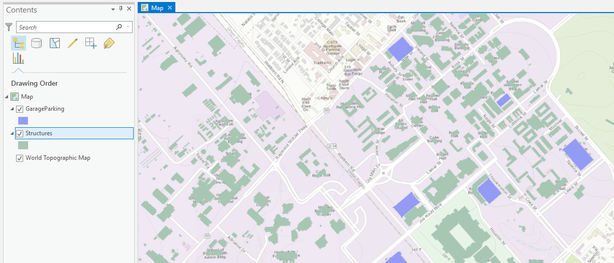
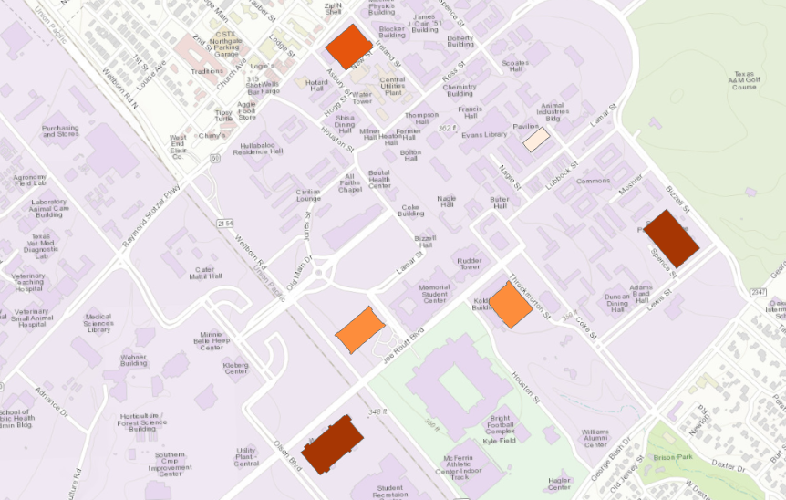

# GEOG-392/676 GIS Programming: Lab 06

>**Topic:** ArcPy Toolbox Advanced Control
>
> **100 pt**
>

## **Due Dates and Submission Instructions**

> **where**: canvas link
>
> **when**: before next lab
>
> **what**: a PDF including all your code and results

## **Task:**

> **Goal**:
>
> 1. Use ArcGIS Pro Toolbox to change the renderer of feature layers in the given ArcGIS Pro project file.
> 2. Add progress bar to the toolbox.
>

## **Data Sources:**

Lab6 will use the same data source files as Lab4/5, except 1 change. The data object to operate through codes is no longer the `.csv` file and `.gdb` directly. You will need to load the `.gdb` in an ArcGIS Pro project manually and use the project file (`.aprx`) file as the input of the toolbox to develop.

## **Reading.1 Renderers**

`Renderers` are used by ArcGIS Pro to determine *how* feature data gets drawn on the screen. Data is just data until we have a renderer that tells the program exactly how that data should presented to the user. The four basic feature renderer types are `SimpleRenderer`, `UniqueValueRenderer`, `GraduatedColorsRenderer`, and `GraduatedSymbolsRenderer`. Below we will dive into what each renderer is and present a use case for why you may want to use a specific renderer.

It is important to note that **NOT** all layers support renderers, so always make sure to check that the layer has a renderer attribute before trying its renderer.

### 1.1 SimpleRenderer

The most basic of renderers, the `SimpleRenderer` is used to draw all features of a layer the same. This is the default renderer used whenever we add a feature class to a map; you know the plain, all-one-color features look. We will not bother diving into how to use this renderer as they are the default and they tend to be rather boring.

### 1.2 UniqueValueRenderer

`UniqueValueRenderer` is used to distinguish features in a feature layer based off of some classification, usually a **`data field`**. With this renderer, we are given programmatic control over the type of field used in the classification of features as well as the color ramp used when drawing said features.

### 1.3 GraduatedColorsRenderer

`GraduatedColorsRenderer` is used to render features in a feature layer based off of a specific field in the feature class. We can use this particular renderer for creating `choropleth` maps programmatically; useful if you need to quickly produce such maps. This renderer gives us control over the style of choropleth produced; allowing the user to determine how many bins are present as well as the color ramp used.

### 1.4 GraduatedSymbolsRenderer

`GraduatedSymbolsRenderer` is quite similar to `GraduatedColorsRenderer` in that each let you render features in a feature class depending on a number of bins and let you specify the color ramp used. This style of renderer is useful for creating graduated symbol styled maps.

## **Task-1 Make a map with `UniqueValueRenderer`**

Our example for `UniqueValueRenderer` focus on automating the creation of a unique value map using the `Structures` feature class in the `Campus.gdb` from previous labs.

**Step.1:**

Open a ArcGIS Pro blank project and add the `Campus.gdb` to this project.Then add the `Structures` feature class to the map. Save this project's folder (the one includes the `.aprx` file) to a location you can reference using `arcpy`. The map should look like this:



Then we can work on the `Python` script. To operate on the `Structures` feature layer, we need to fetch it following the project's data hierarchy:

```shell
project -> Map -> layers list[] -> `Structures` layer
```

Using the method `listLayers()` we can get a list of all layers in the map from which we can iterate through. The first thing we want to do is make sure the layer is a `feature layer`. We can check using a simple conditional that checks the current layer's `isFeatureLayer` attribute: if it is true we continue to set the `renderer`. The next step is to create a copy of the current feature layer's `symbology`. `Symbology` is the attribute that contains a layer's renderer. We copy the symbology to make the naming a little easier to read. 

Code example to fetch the `Structures` feature layer and its `symbology` is shown below:

```python
import arcpy

PROJ_PATH = r"***/***/***.aprx"

project = arcpy.mp.ArcGISProject(PROJ_PATH)

mapObj = project.listMaps('Map')[0] # There is only 1 'Map' object in this project.

for layer in mapObj.listLayers():
    # Check that the layer is a feature layer
    if layer.isFeatureLayer:
        # Obtain the symbology object from layer
        symbology = layer.symbology
        # Make sure the "Structures" layer has a renderer
        if hasattr(symbology, 'renderer') and layer.name=="Structures":
            ......
```

Now that we have the feature class we want, we can finally start to change our renderer. The whole process is surprisingly quick and simple if you choose to let arcpy decide the colors and some of the other finer details. With our variable `symbology` we simply call `updateRenderer()` and provide the string value `UniqueValueRenderer`. Keep in mind that this has only changed the renderer of the temporary `symbology` object, not the actual layer's `symbology`. We'll address that in a moment.

Once the renderer is updated, we need to let `arcpy` know what field we want to symbolize our features with. We can set that with `symbology.renderer.fields` and set the value of that equal to a list that contains the field we want to symbolize our features. Now then, set the layer's symbology back to the symbology copy we updated. Without this line we will not see any changes. The last step is to simply save a copy of our project's `.aprx` as a new project if we desire and we're done!

Full code example is below:

```python
import arcpy

PROJ_PATH = r"***/***/***.aprx"

project = arcpy.mp.ArcGISProject(PROJ_PATH)

mapObj = project.listMaps('Map')[0] # There is only 1 'Map' object in this project.

for layer in mapObj.listLayers():
    # Check that the layer is a feature layer
    if layer.isFeatureLayer:
        # Obtain the symbology object from layer
        symbology = layer.symbology
        # Make sure the "Structures" layer has a renderer
        if hasattr(symbology, 'renderer') and layer.name=="Structures":
            # Change the renderer to 'UniqueValueRenderer'
            symbology.updateRenderer('***')
            # Use the 'Type' column as the unique value column
            symbology.renderer.fields = ["***"]
            # IMPORTANT!!! update the layer's symbology as the updated one 
            layer.symbology = symbology
        else:
            print("No desired feature class...")
# save a copy of the updated project.
project.saveACopy(r"***/***/***_new.aprx")
```

You should see your map as something like this:


## Task-2. Make a map with **`GraduatedColorsRender`**

Similar to the previous section, we will use the `GraduatedColorsRender` to create a choropleth map on the `Trees` feature layer from the `Campus.gdb` based off the `Shape_Area` date field. Add the layer to the map and save to the usual location. Create a new, plain Python script and import arcpy. Create a variable that references the newly created project file.

Like the previous section, we need to fetch the feature layer, the symbology, and the renderer. When changing the renderer, we will pass the value of `GraduatedColorsRenderer` in the `updateRenderer()` method. After that, we set the `symbology.renderer.classificationField` as the data field which we want to determine the classification. In our case, this value should be `Shape_Area`. 
And here is an example of the colorramp: `'Oranges (5 Classes)'`
For the detailed config of the `GraduatedColorsRender`, we set 5 bins for the breakout of the classification. For the color map setting, we want them to be 5 classes in oranges spectrum. The codes should look like below:

```python
import arcpy

PROJ_PATH = r"***/***/***.aprx"

project = arcpy.mp.ArcGISProject(PROJ_PATH)

mapObj = project.listMaps('Map')[0] # There is only 1 'Map' object in this project.

for layer in mapObj.listLayers():
    # Check that the layer is a feature layer
    if layer.isFeatureLayer:
        # Obtain the symbology object from layer
        symbology = layer.symbology
        # Make sure the "Structures" layer has a renderer
        if hasattr(symbology, 'renderer') and layer.name=="Trees":
            # Change the renderer to 'UniqueValueRenderer'
            symbology.updateRenderer('***')
            # Tell arcpy which field we want to base our choropleth off of
            symbology.renderer.classificationField = "***"
            # Set how many classes we'll have 
            symbology.renderer.breakCount = ***
            # Set the color ramp
            symbology.renderer.colorRamp = project.listColorRamps('***')[0]
            # Set the layer's actual symbology equal to the copy's
            layer.symbology = symbology # Very important step
        else:
            print("No desired feature class...")
# save a copy of the updated project.
project.saveACopy(r"***/***/***_new.aprx")
```

And the result should look like:


## Reading.2 Progressor in ArcGIS Pro Toolbox

A `progressor` is an important element we can add to a tool to improve the overall experience. It's just the little bar that users can see which step the tool is currently working on. There are two types of progressor: `default` and `step`. The `default progressor` displays a moving bar that constantly moves back and forth. This is good to use when we do not know how long something will take or if the operation takes a while. `Step` is the progressor type we will create below. With step we can advance the progressor in increments after a specific piece of code has executed.

Inside of the `execute()` method, go ahead and define the following variables:

```python
    readTime = 3
    start = 0
    maximum = 100
    step = 25
```

`readTime` is used to delay the `progressor` titles by a small margin so that the user can actually read them without the text flashing away. The variable `start` defines the beginning position of our progressor, `maximum` defines the absolute maximum value, and `step` is used to move the progressor along.

Once our variables are defined we can setup the progressor and advance it after key portions of our tool have finished executing. Setting up a progressor involves calling `arcpy.SetProgressor()` and providing in five parameters: the type of progressor, the progressor label, the start value, the end value, and a step value.

```python
# Setting up the progressor
arcpy.SetProgressor("step", "Checking building proximity...", start, maximum, step)
```

And use the `SetProgressorPosition()` and `SetProgressorLabel()` to advance the progressor.

```python
arcpy.SetProgressorPosition(start + step)
arcpy.SetProgressorLabel("some message here...")
time.sleep(readTime)
```

The method SetProgressorPosition changes the "percentage" completed of the progressor while SetProgressorLabel changes the message displayed alongside the progressor. The last line involves importing the time module; we fix this with import time just below import arcpy. When we call time.sleep(readTime) we are momentarily halting the execution of our tool. This is used just so we can see the progressor labels changing.

## Task-2. Add a `Progressor` to your tool

Apply the `Step` progressor to the tool you build. 
Here is an example of the `execute()` and the `getParameterInfo` method in a tool `step progressor` added.

```python
# -*- coding: utf-8 -*-

import arcpy
import time

def getParameterInfo(self):
    """Define parameter definitions"""
    param_proj_path = arcpy.Parameter(
        ***
    )
    param_layer_name = arcpy.Parameter(
        ***
    )
    # other optional parameters

    params = [
        param_proj_path, 
        param_layer_name, 
        '''
        If you have other optional parameters, put them here.
        '''
        ]
    return params

# Other functions...

def execute(self, parameters, messages):
    """The source code of the tool."""
    
    # setup the progressor
    # 3s should be enough for you to take screenshots for submission
    readTime = 3
    start = 0
    max = 100
    step = 25
    # >>>>>>>>>>
    arcpy.SetProgressor(***)
    # <<<<<<<<<<
    # Add message to the results pane
    arcpy.AddMessage("Init tool...")

    # Accept user input from toolbox interface
    aprxFilePath = parameters[0]
    layerName = ***
    # other params are oprional
    outputPath = ***

    # fetch the project
    project = arcpy.mp.ArcGISProject(aprxFilePath)
    """
        Fetch the list of layers
        the data structure is:
        project 
        >   map list(name is 'Map')
            >    map (id is 0)
                    >    layer list
    """
    layers = project.listMaps('Map')[0].listLayers()
    
    for layer in layers:
        if layer.isFeatureLayer:
            symbology = layer.symbology
            # Advance the progressor here
            arcpy.SetProgressorPosition(***)
            arcpy.SetProgressorLabel(***)
            arcpy.AddMessage("Finding the layers...")
            time.sleep(readTime)
            # End of advancing progessor
                if hasattr(symbology, 'renderer') and layer.name == 'Structures':
                    # re-render the 'structures' layer into 'UniqueValueRenderer'
                    # >>>>>>>>>>

                    # <<<<<<<<<<
                    # Advance the progressor here
                    arcpy.SetProgressorPosition(***)
                    arcpy.SetProgressorLabel(***)
                    arcpy.AddMessage("Re-rendering...")
                    time.sleep(readTime)
                elif hasattr(symbology, 'renderer') and layer.name == 'trees':
                    # re-render the 'trees' layer into 'GraduateColorsRenderer'
                    # >>>>>>>>>>

                    # <<<<<<<<<<
                    # Advance the progressor here
                    arcpy.SetProgressorPosition(***)
                    arcpy.SetProgressorLabel(***)
                    arcpy.AddMessage("Re-rendering...")
                    time.sleep(readTime)
                else:
                        # Error message
    
    # Save the updated project into a new copy.
    project.saveACopy(***)
    # Advance the progressor here
    arcpy.SetProgressorPosition(***)
    arcpy.SetProgressorLabel(***)
    arcpy.AddMessage("Saving the project...")
    time.sleep(readTime)

    return

```

## Submission

To get full credits, your `***.pyt` code should implement an `ArcGIS Pro` tool box that:

- accepts inputs including:
  - The working project path
  - The layer's name
  - The output project path (Optional)
- change the renderer of `Structures` feature layer from the `Campus.gdb` to `UniqueValueRenderer` on the column `Type`.
- change the renderer of `Trees` feature layer from the `Campus.gdb` to `GraduatedColorsRenderer` on the column `Shape_Area`.

Your results should include screenshots that show:

- the interface of the tool.
- the original map.
- the output after re-rendering the `Structures` feature layer.
- the output after re-rendering the `Trees` feature layer.
- the `progressor` when running the tool.

## Grading Rule

| **Criteria**                                      | **Points** |
|:--------------------------------------------------|:----------:|
| **Code on GitHub (60 points total):**             |            |
| Adequate commenting                               | 10 pt      |
| User Input Handling                               | 10 pt      |
| `Execute` func correctly handles 2 re-renderings  | 30 pt      |
| **Deliverables (40 points total):**               |            |
| Screenshot of the original map                    | 10 pt      |
| Screenshot of tool interface & `progressor`       | 10 pt      |
| Screenshot of the re-rendered `Structures` layer  | 10 pt      |
| Screenshot of the re-rendered `Trees` layer       | 10 pt      |

## References

- http://pro.arcgis.com/en/pro-app/arcpy/mapping/arcgisproject-class.htm
- http://pro.arcgis.com/en/pro-app/arcpy/mapping/layer-class.htm
- http://pro.arcgis.com/en/pro-app/arcpy/mapping/colorramp-class.htm
- http://pro.arcgis.com/en/pro-app/arcpy/mapping/uniquevaluerenderer-class.htm
- http://pro.arcgis.com/en/pro-app/arcpy/mapping/graduatedcolorsrenderer-class.htm
- http://pro.arcgis.com/en/pro-app/arcpy/mapping/symbology-class.htm
- http://pro.arcgis.com/en/pro-app/arcpy/mapping/layer-class.htm

- http://pro.arcgis.com/en/pro-app/arcpy/geoprocessing_and_python/writing-messages-in-script-tools.htm
- http://pro.arcgis.com/en/pro-app/arcpy/geoprocessing_and_python/controlling-the-progress-dialog-box.htm#GUID-BC06043D-A7D7-49A5-A341-D72C54A01AFD
- http://pro.arcgis.com/en/pro-app/arcpy/geoprocessing_and_python/understanding-the-progress-dialog-in-script-tools.htm
