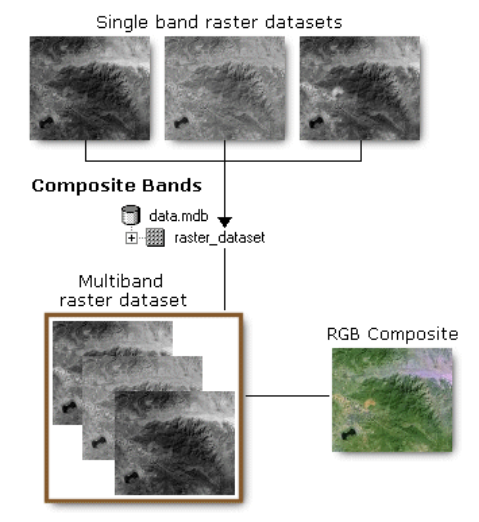

# GEOG-392/676 GIS Programming: Lab 07

>**Topic:** ArcPy Toolbox Advanced Control
>
> **100 pt**
>

## **Due Dates and Submission Instructions**

> **where**: canvas link
>
> **when**: before next lab
>
> **what**: a PDF including all your code and results

## **Task:**

> **Goal**:
>
> 1. Read & explore raster data files.
> 2. Visualize & manipulate single/multi-band rasters.
> 3. Apply ArcPy raster math functions on Digital Elevation Models (DEM) and multispectral satellite imagery (LandSAT).

## **Data Sources:**

- Single-band image: [DEM](https://github.com/TAMUCIDI/GEOG-392-GIS-Programming/tree/main/Labs/Lab07/Data/DEM)

- Multispectral image: [LandSAT](https://github.com/TAMUCIDI/GEOG-392-GIS-Programming/tree/main/Labs/Lab07/Data/LandSAT)

## **Pre-Readings:**

### Raster Data

On many occasions, you will need to work with raster data in a scripting environment. Luckily, ArcPy provides access to a vast library of raster processing tools and techniques to get the job done. Since raster data processing is so integral to modern GIS, ArcPy raster processing capabilities are spread across several places in the ArcPy language. These include, but are not limited to:

- [Core ArcPy Raster Objects](http://pro.arcgis.com/en/pro-app/arcpy/classes/raster-object.htm);
- [3D Analyst Toolbox function](http://pro.arcgis.com/en/pro-app/tool-reference/3d-analyst/an-overview-of-the-3d-analyst-toolbox.htm);
- [Spatial Analyst Toolbox function](http://pro.arcgis.com/en/pro-app/arcpy/spatial-analyst/an-overview-of-spatial-analyst-classes.htm);
- [Data Management Toolbox](http://pro.arcgis.com/en/pro-app/tool-reference/data-management/make-raster-layer.htm)

Some of the most common raster tasks that you will be using ArcPy for include the following:

- [Converting from rasters to other things](http://pro.arcgis.com/en/pro-app/tool-reference/3d-analyst/raster-domain.htm);
- [Performing interpolation on raster data sets](http://pro.arcgis.com/en/pro-app/tool-reference/3d-analyst/an-overview-of-the-raster-interpolation-toolset.htm);
- [Creating a variety of outputs from a raster surface](http://pro.arcgis.com/en/pro-app/tool-reference/3d-analyst/an-overview-of-the-raster-surface-toolset.htm);
- [Classifying and reclassifying rasters](http://pro.arcgis.com/en/pro-app/tool-reference/3d-analyst/an-overview-of-the-raster-reclass-toolset.htm);
- [Applying many different types of global, local, and zonal functions](http://pro.arcgis.com/en/pro-app/help/data/imagery/list-of-raster-functions.htm)

### Hillshade

Hillshade documentation: [link](http://pro.arcgis.com/en/pro-app/help/data/imagery/hillshade-function.htm)

How `HillShade` works: [link](https://pro.arcgis.com/en/pro-app/latest/tool-reference/3d-analyst/how-hillshade-works.htm)

The `HillShade` method from `arcpy.ddd` module creates a shaded relief from a surface raster by considering the illumination source angle and shadows. The `hilllshade` raster has an integer value range from 0 to 255. The illumination source is considered as infinity.


### Slope

Slope documentation: [link](http://pro.arcgis.com/en/pro-app/help/data/imagery/slope-function.htm)

How `Slope` works: [link](https://pro.arcgis.com/en/pro-app/latest/tool-reference/3d-analyst/how-slope-works.htm)

The `Slope` method from `arcpy.ddd` module identifies the slope (gradient or steepness) from each cell of a raster. This tool uses a 3 by 3 cell moving window to process the data. If the processing cell is NoData, the output for that location will be NoData. Of the eight cells neighboring the processing cell, this tool requires that at least seven of them have a valid value. If there are fewer than seven valid cells, the calculation will not be performed, and the output at that processing cell will be NoData.

The range of values in the output depends on the type of measurement units.

- For degrees, the range of slope values is 0 to 90.
- For percent rise, the range is 0 to essentially infinity. A flat surface is 0 percent, a 45 degree surface is 100 percent, and as the surface becomes more vertical, the percent rise becomes increasingly larger.


### Composite Imagery from multi-spectrum images

Composite bands documentation: [link](https://pro.arcgis.com/en/pro-app/latest/tool-reference/data-management/composite-bands.htm)

Creating a composite image means creating one image from several different bands. Landsat images can be displayed in natural color or red-green-blue (RGB) with a composite image. Displaying multiple bands in color allows features within a scene to be distinguished from each other. This helps differentiate between land cover types, including urban areas, forests, agriculture, and water bodies, for example.



Take the [LandSAT](https://github.com/TAMUCIDI/GEOG-392-GIS-Programming/tree/main/Labs/Lab07/Data/LandSAT) dataset as an example. There are 4 bands of images in the dataset:


Data contained in each band comprises a different slice of the electromagnetic spectrum.:

```shell
"***_B1.tif"    # Blue
"***_B2.tif"    # Green
"***_B3.tif"    # Red
"***_B4.tif"    # Near InfraRed (NIR)
```

If we load single band `.tif` file in the map, it only shows monochrome patterns. To recover the original image, we can use the `composite tool` to combine multiple bands of the image set to construct a composite image.

### NDVI

The Normalized Difference Vegetation Index (NDVI) measures the greenness and the density of the vegetation captured in a satellite image. Healthy vegetation has a very characteristic spectral reflectance curve which we can benefit from by calculating the difference between two bands – visible red and near-infrared. NDVI is that difference expressed as a number – ranging from -1 to 1. [source](https://eos.com/make-an-analysis/ndvi/)

NDVI is derived from satellite imagery and calculated in accordance with the formula:

$$
    NDVI = \frac{NIR - RED}{NIR + RED}\\
    Esri\_NDVI = \left( \frac{NIR - RED}{NIR + RED} \right)*100 + 100
$$

## **Task1: Get `HillShade` & `Slope` of the singleband `DEM` dataset**

The original `DEM` raster layer should look like this:

Call `arcpy.ddd.HillShade` to get the `HillShade` raster from `DEM` values. The API documentation is: [`arcpy.ddd.HillShade` docs](https://pro.arcgis.com/en/pro-app/latest/tool-reference/3d-analyst/hillshade.htm).

```python
import arcpy

arcpy.ddd.HillShade(
    <input raster full path>,   # replace this with your `DEM` tif file path.
    <output raster full path>,  # replace this with your output tif file path.
    {<azimuth value>},          # `{**}` means this param is optional, the default value of this dataset's azimuth should be 315
    {<altitude>},               # the default value of this dataset's altitude value of this dataset's altitude should be 45
    {<shadows>},                # we don't need to add shadows to this case, so set "NO_SHADOWS" to this param
    {<z_factor>},               # default value is 1
)
```

It should look like this:


And then call `arcpy.ddd.Slope` to get the `Slope` raster from `DEM` layer. The API documentation is: [`arcpy.ddd.Slope`](https://pro.arcgis.com/en/pro-app/latest/tool-reference/3d-analyst/slope.htm).

```python
import arcpy

arcpy.ddd.Slope(
    <input raster full path>,   # replace this with your `DEM` tif file path
    <output raster full path>,  # replace this with your output tif file path
    {<measurement>},            # `{**}` means this param is optional, the default value of this dataset's measurement should be "DEGREE"
    {<z_factor>},               # `{**}` means this param is optional, the default value of this dataset's z_factor should be 1
)
```

The result should look like this:


## **Task2-1: Construct `Composite Image` of the multi-band `LandSAT` dataset**

The original images of all bands from the given `LandSAT` dataset look like:

Band1 (`Blue`):

Band2 (`Green`):

Band3 (`Red`):

Band4 (`NIR`):


Use the [`CompositeBands`](https://pro.arcgis.com/en/pro-app/latest/tool-reference/data-management/composite-bands.htm) method from `arcpy.management` module to get the **`RGB`** composite raster from a list of raster bands. The first parameter of the `arcpy.management.CompositeBands` function is the list of `.tif` files or the list of `Raster` object read from bands' `.tif` files. And the second parameter is the full path of the output `raster` layer.

The API documentation of `arcpy.sa.Raster` to load `.tif` file as a `raster` object is: [link](https://pro.arcgis.com/en/pro-app/latest/arcpy/classes/raster-object.htm)

**BE CAREFUL WITH:**

The element order in the list (1st parameter in `CompositeBands` func) should follow the order of `RED-GREEN-BLUE`, so that the outpu raster represents a real `RGB` image. And **YOU DONT NEED `NIR` BAND** at this step.

```python
import arcpy

# ********************
# BE CAREFUL
# The order of the list of the bands' path should follow the order of R-G-B to get a correct RGB composite raster.
# ********************
arcpy.management.CompositeBands(
    
    "<band-RED-full-path>;<band-GREEN-full-path>;<band-BLUE-full-path>",
    "compbands.tif"
)

# OR

band_RED = arcpy.sa.Raster(<full-path-to-RED-band>) # replace the <full-path-to-RED-band> to your path to the band represents RED value.
band_GREEN = arcpy.sa.Raster(<full-path-to-GREEN-band>) # replace the <full-path-to-GREEN-band> to your path to the band represents GREEN value.
band_BLUE = arcpy.sa.Raster(<full-path-to-BLUE-band>) # replace the <full-path-to-BLUE-band> to your path to the band represents BLUE value.

# ********************
# BE CAREFUL
# The order of the list of the bands' objs should follow the order of R-G-B to get a correct RGB composite raster.
# ********************
arcpy.management.CompositeBands(
    [band_RED, band_GREEN, band_BLUE],
    "compbands.tif"
)
```

Yout result should look like:


To tell if your output `RGB` composite image is correct, you can zoom into southwest of Houston in the map (right bottom corner in the previous figure). And the cloud's color should be pure white. If not, that probably means the order you input bands is incorrect.


## **Task2-2 Calculate the `NDVI` of the multi-band `LandSAT` dataset**

Load the bands from the `LandSAT` dataset into `Raster` objects using [`arcpy.sa.Raster()`](https://pro.arcgis.com/en/pro-app/latest/arcpy/classes/raster-object.htm). And come up with your own codes to calculate the `ESRI_NDVI` raster using the formula mentioned in the `pre-read` section. You code structure at this step should be like:

```python
import arcpy

BASE_DIR = r"***"

band_RED = arcpy.sa.Raster(f"{BASE_DIR}\\***.TIF")
band_GREEN = arcpy.sa.Raster(f"{BASE_DIR}\\***.TIF")
band_BLUE = arcpy.sa.Raster(f"{BASE_DIR}\\***.TIF")
band_NIR = arcpy.sa.Raster(f"{BASE_DIR}\\***.TIF")

# >>>>>>>>>>>>>>>>>>>>>>>>>>>
# Add your code here
# Compute the NDVI values
# formula: NDVI_ESRI = ((NIR - RED)/(NIR + RED))*100 + 100
band_NDVI = ***
# <<<<<<<<<<<<<<<<<<<<<<<<<<<

band_NDVI.save(f"{BASE_DIR}\\***.TIF")
```

And then load this output `NDVI` raster `.TIF` file into ArcGIS Pro. It should look like:


If you use the `Colormap` tool from the `Raster Functions` in ArcGIS Pro to change the colormap of the output `NDVI` raster to the `NDVI3` colormap.


You should see the raster looksl like:


## **Submission**

To get full credits, your `***.py` code should implement an script that:

- Create new raster layers based on the given `DEM` datasets, including:
  - `HillShade` layer.
  - `Slope` layer.
- Create new `RGB composite` layer based on the given `LandSAT` datasets
- Calculate the `ESRI NDVI` values based on the given `LandSAT` datasets

Your results should include screenshots that show:

- The original raster layers of all given datasets (5 layers in total).
- The output `HillShade` raster layer.
- The output `Slope` raster layer.
- The output `RGB Composite` raster layer.
- The output `ESRI NDVI` raster layer and the `colormap` updated layer.

## **Grading Criteria**

| **Criteria**                                      | **Points** |
|:--------------------------------------------------|:----------:|
| **Code (50 points total):**                       |            |
| Github Link                                       | 10 pt      |
| Adequate commenting                               | 10 pt      |
| Create `HillShade` & `Slope` rasters              | 10 pt      |
| Create `RGB Composite` raster layer               | 10 pt      |
| Create `ESRI NDVI` raster layer                   | 10 pt      |
| **Deliverables (50 points total):**               |            |
| Screenshot of the original raster layers          | 10 pt      |
| Screenshot of the output `HillShade` layer        | 10 pt      |
| Screenshot of the output `Slope` layer            | 10 pt      |
| Screenshot of the output `RGB Composite` layer    | 10 pt      |
| Screenshot of the output `ESRI NDVI` layers (before & after updating `Colormap`)    | 10 pt      |
